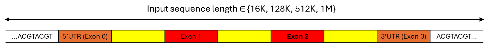
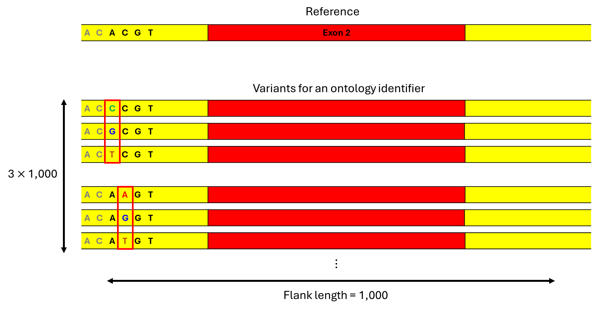

# AlphaGenome ISM Workflow

Reproducible workflow for *in silico mutagenesis* (ISM) scoring using [AlphaGenome](https://github.com/google-deepmind/alphagenome). The analysis proceeds through three steps:

1. Visualize gene of interest
2. Variant generation and prediction
3. ISM scoring and sequence logos

The `alphagenome` library code is not modified; notebooks import and use its public API. For more information, please visit the original[ AlphaGenome project site](https://github.com/google-deepmind/alphagenome/tree/main).

---
## 1. Installation

First, get the AlphaGenome API key from https://deepmind.google.com/science/alphagenome/

Create and activate a Python environment (Python ≥3.10 recommended):

```bash
conda create -y -n alphagenome_env python=3.11
conda activate alphagenome_env
pip install -e alphagenome biopython pandas numpy matplotlib
```

---
## 2. Reference Data (GRCh38 / GENCODE v46)

Download primary assembly FASTA:

```bash
cd data
wget https://ftp.ebi.ac.uk/pub/databases/gencode/Gencode_human/release_46/GRCh38.primary_assembly.genome.fa.gz
gunzip GRCh38.primary_assembly.genome.fa.gz
cd ..
```

Note: AlphaGenome does not support GENCODE versions higher than v46.

---
## 3. Configuration

Edit parameters in `config.json` before running `combined_workflow.ipynb`:

- **gene_symbol**: Target gene name (e.g., "SMN2")
- **dna_api_key**: AlphaGenome API key
- **ontology_terms**: Cell/tissue context identifiers (UBERON/CL ontology). See `results/*metadata.csv`
- **requested_outputs**: Prediction types (e.g., ["RNA_SEQ", "SPLICE_SITE_USAGE"]). See `utils.py/save_all_metadata` for all supported output formats.
- **exon_index**: Zero-based index of target exon
- **flank**: Bases to include around exon for variant window (<250 recommended)
- **strand**: Strand filter ("+", "-", or "all"; see `utils.py/filter_by_strand`)
- **track_filter**: Substring to filter tracks (optional; polyA plus RNA-seq by default)

---
## 4. How it works - ISM
This section briefly explain how ISM works using AlphaGenome.

When you provide a gene name and an exon sequence (or specify regions to be included or excluded during splicing), a complete gene sequence is retrieved from the GTF file and augmented to match one of the specified sizes: 16k, 128k, 512k, or 1M.

Single nucleotide variants (SNVs) are generated sequentially, as illustrated in the figure. Since each nucleotide can undergo three possible mutations, the total number of SNVs is calculated as the flank length multiplied by three. The notebook utilizes the AlphaGenome API to process about 3,000 mutations, resulting in a numpy array sized (input length x flank length x 3) for each ontology identifier.

Note that only the scores from the exon regions are used to assess variant effects. The score of each variant is subtracted from the reference score. A positive difference indicates that the mutation has increased the score (e.g., RNA-seq, splice-site usage) of that exon.